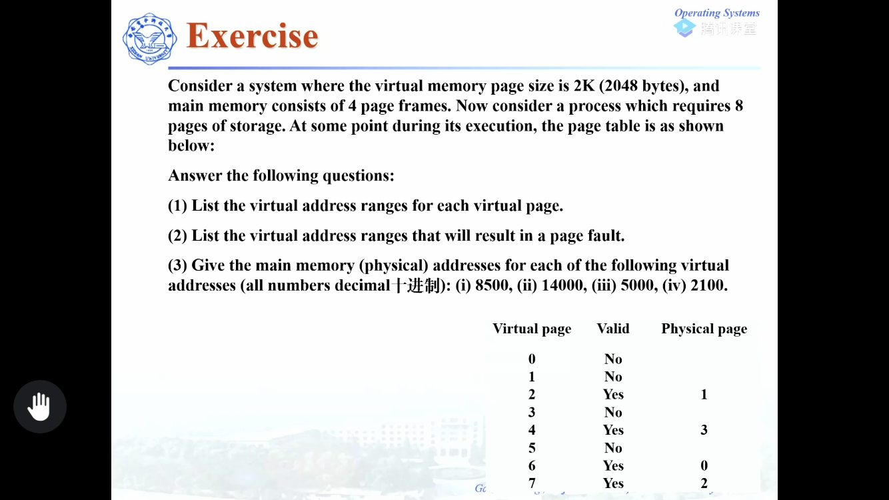
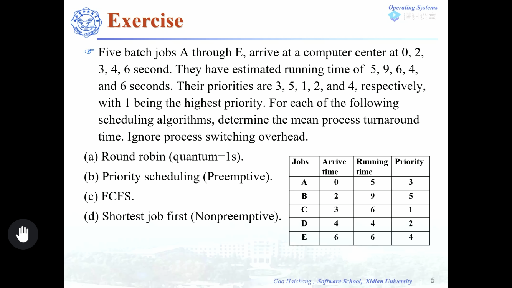

##  exercise习题课

### 程序运行时间

Minimum time=5+5=10  (1CUP while 2 I/O, 2CPU while 1 I/O), maximum time=10+10，average time=13.33
求解平均运行时间的时候需要用到CPU利用率， $ Average\ time=minimum\ time /CPU\ utilization$
$$ CPU\ utilization =1-q^n (n是程序个数，p是I/O占比) $$ 

###  虚拟内存物理内存地址关系

（1）虚拟地址范围, $ page\ size = page\ frame\ size$, page frame: the corresponding units in physical memory（via，MOS）.进程中的块，称为页（page）,内存中的块称为页框（page frame或页帧，物理页）。

| virtual page | address range |
| :----------: | :-----------: |
|      0       |    0~2047     |
|      1       |   2048~4095   |
|      2       |   4096~6143   |
|      3       |   6144~8191   |
|      4       |  8192~10239   |
|      5       |  10240~12287  |
|      6       |  12288~14335  |
|      7       |  14336~15359  |

(2) 在0，1，3，5范围内的均会发生缺页中断（page fault）

(3)注意题目要求我们由虚拟地址求实际的物理地址。首先我们需要确定在哪一个虚拟页（virtual page），然后确定偏移量（offset），根据虚拟页和物理页的关系得出实际的物理地址。
(i)8500=2048*4+308, 对应虚拟页4, offset 308，而虚拟页4对应物理页3，故实际物理地址为6144+308=6452
	14000=6\*2048+1712,对应虚拟页6，offset 1712，而虚拟页6对应物理页0，故实际物理地址为0+1712=1712
	5000=2048\*2+904,对应虚拟页2，offset 904，而虚拟页2，对应物理页1，故实际物理地址为2048+904=2952
	2100=2048\*1+52，对应虚拟页1，无效（valid显示no），没有对应的物理地址。

### Managing free memory

答案如下图

### scheduling 调度

周转时间=作业完成时间-作业提交时间，平均周转时间=$ \frac{{\sum\limits_{\rm{1}}^n 作业i的周转时间 }}{n}$

平均周转时间表

|   算法   |  A   |  B   |  C   |  D   |  E   | 平均周转时间 |
| :------: | :--: | :--: | :--: | :--: | :--: | :----------: |
|    RR    |  16  |  28  |  22  |  15  |  20  |     20.2     |
| priority |  15  |  28  |  6   |  9   |  15  |     14.6     |
|   FCFS   |  5   |  12  |  17  |  20  |  24  |     15.6     |
|   SJF    |  5   |  28  |  12  |  5   |  15  |      13      |

### Deadlock

(1) The current state is a safe state.

| Process | Max need | Already have | Still nedd | Available |
| ------- | -------- | ------------ | ---------- | --------- |
| P1      | 1 2 3 4  | 1 2 1 0      | 0 0 2 4    | 1 1 0 1   |
| P2      | 1 1 2 2  | 0 1 2 2      | 1 0 0 0    |           |
| P3      | 1 3 1 1  | 1 3 0 1      | 0 0 1 0    |           |
| P4      | 1 1 2 3  | 0 1 0 1      | 1 0 2 2    |           |

P2->P3->P4->P1, Available:1101->1223->2524->2625->3835.

(2)P1 request one resource R4, can system allocate R4 to P1?Why?
意思就是current available 变成 1 1 0 0（将R4立即分配给了P1），状态是否还安全。

| Process | Max need | Already have | Still nedd | Available |
| ------- | -------- | ------------ | ---------- | --------- |
| P1      | 1 2 3 4  | 1 2 1 1      | 0 0 2 3    | 1 1 0 0   |
| P2      | 1 1 2 2  | 0 1 2 2      | 1 0 0 0    |           |
| P3      | 1 3 1 1  | 1 3 0 1      | 0 0 1 0    |           |
| P4      | 1 1 2 3  | 0 1 0 1      | 1 0 2 2    |           |

P2(Available:1222), P3(Available:2523), P4(Available:2624), P1(Available:3835), Still safe.

