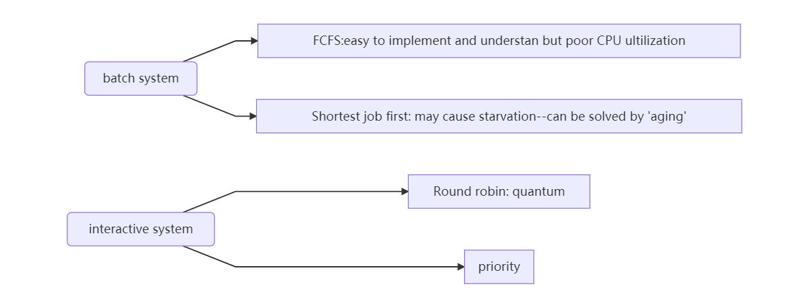

# Summary of Modern Operating System

知识点总结，可以用复习时检查完整度。

## Processes and Threads

### Processes

> - process model
>   - What is process? consist of ?
> - process creation
>   - four events that cause process creation
>   - resource sharing(3 cases), execution(concurrently or not), address space
> - process termination
>   - four conditions that terminate process
>   - In what situation parent may terminate child processes.
> - process state
>   - new, running, blocked, ready, terminated
>   - diagram of process state(important)
>   - when to switch, context switch
> - implementation of process
>   - main: PCB

### Threads

> - Thread model
>
>   - what is thread? consist of? properties?
>   - what items are shared between threads, what are ***private*** to each other?
>
> - Implementing threads
>
>   - three mechanism(kernel space, user space, hybrid)
>
> - Scheduling
>
>   
>
>   

## Deadlock

> - Definition and types of resource 
> - Deadlock 
>   - definition 定义
>   - four conditions for deadlock 
>   - strategies dealing with deadlock 
>     - esp. detection and recovery 
> - Recovery from deadlock 
>   - preemption, rollback, killing processes
> - Deadlock avoidance
>   - safe state, Banker's Algorithm
> - Deadlock prevention
>   - attacking four conditions for deadlock
> - Starvation

## Memory Management

## Input and Output

### I/O

> - I/O device
>
>   - main function (send commands, catch interrupts, handle errors, provide an interface)
>   - category: block device, character device 
>   - device independence
>
> - I/O device components
>
>   - mechanical component
>   - electronic component (control the device)
>     - convert serial bit stream into a block of bytes
>     - Perform error correction
>     - copy data to main memory
>   - registers and buffer
>
> - I/O and Memory
>
>   - separated I/O and memory space
>   - memory-mapped I/O (important)
>     - Advantages: written entirely in C; no special protection needed; simple instruction
>     - disadvantages: 多数电脑有caching机制，control register数据内容不实时；
>   - hybrid: memory-mapped I/O buffers, separate I/O ports for the control registers.
>
> - DMA (important)
>
>   
>
> - interrupt
>
> - I/O software
>
>   - Goals: device independence, uniform naming, error handling, syn & asyn transfer, buffering, sharable & dedicated
>
> - Three ways to perform I/O (important, pay attention to pro&cons)
>
>   - programed I/O
>   - interrupt-driven I/O
>   - I/O using DMA
>
> - I/O software layers
>
>   

### Disk

> - Disks
>   - category: optical disk, magnetic disk, SSD
>   - component: cylinder, track, sector
>   - RAID(Redundant Array of Independent Disk), 独立磁盘冗余阵列
> - CD-ROM原理
> - Disk Formatting
>   - disk sector consists of preamble, data, ECC
>   - cylinder skew
>   - interleaving
> - Disk Arm Scheduling Algorithm (important)
>   - FCFS,  shortest seek first, the elevator algorithm
>   - error handling
> -  SSD
> - Clock
>   - traditional clock(low frequency), programmable clock (high frequency, flexible)