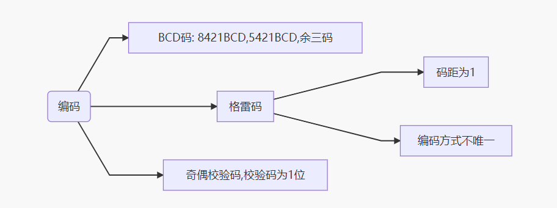

# 软工数电考点总结

​	本文无题目，仅提供知识点参考。文中课本为《数字电子技术》（第四版），江晓安，2015年2月第四版。

## 第一章

 - 数制转换（包括整数和小数）

   - 10、2、8、16进制相互转换
   - 特别的，对于整数：短除后倒序余数；小数：乘以2后与1比较，大得1，小上0，结果为1时停止。
     （见课本P4）

 - 编码

   
   
   注意8421BCD码与余三码的转换。
   
   练习见课本P10-11课后题。

## 第二章

> 常用逻辑函数、逻辑门的功能及其表示
>
> - 表达式、真值表、逻辑门符号、波形
>
> Here  is the graph.
>
> 集成逻辑门
>
> - 基本概念
> - oc门和三态门的功能。（例题，作业）
>   - oc门逻辑门符号，使用（并联时需要上拉电阻与直流电源），作用：线与
>   - 三态门 逻辑门符号，功能：三态（使能端有效则工作，否则为高阻态）

## 第三章

> ***基本公式和法则***
>
> - 公式：分配律，吸收律（3个），多余项定律，求反律（摩根定律）
> - 法则：代入法则（等式中变量由函数代替仍成立），对偶法则（+换成●，●换成+，0变成1，1变成0），反演法则（摩根定律）
>
> ***基本公式的应用***
>
> - **逻辑函数不同形式的转换（与或，与非，或非，或与，与或非）**，逻辑函数化简（基本公式的应用），证明等式成立
>
> **逻辑函数代数法化简（卡诺图）**
>
> - 最小项，最小项表达式概念（需要十分清楚）
> - **<u>*卡诺图与卡诺图化简（全书最重要知识点之一）*</u>**
>   - 相邻项的概念，如何在卡诺图中找相邻项
>   - 能够画出给出函数的卡诺图
>   - 能够用卡诺图法将函数化简成最简**式（与非，或非，与或，或与，与或非）
>   - **完全描述逻辑函数和非完全描述逻辑函数**