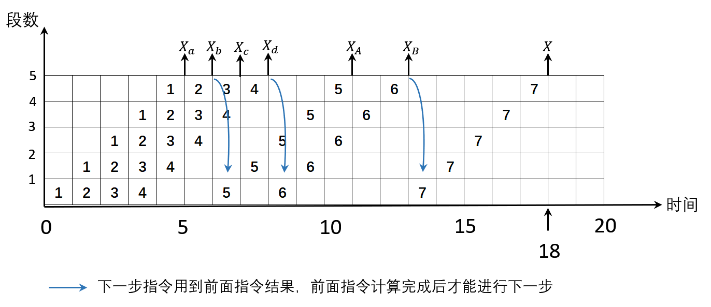

# 计组II Solution Manual

## 第六章

### 习题6.5

某CPU内有5级指令流水线，每级的处理时间(包括级间缓冲延迟)为10ns,5ns,5ns,10ns,5ns。
(1）当执行1000条指令时，该流水线的吞吐率和加速比为多少?
(2）若要改进该流水线的性能，可对流水线做何改造?改造后的流水线吞吐率可达到多少?

解：

(1):

​	吞吐率：$TP=\dfrac{n}{T_{流水}}=\dfrac{1000}{\sum\limits_{i=1}^{5}\Delta t_{i}+(1000-1) \times \Delta t_{max}}=99.75 \ MIPS$

​	加速比：$S=\dfrac{T_{顺}}{T_{流水}}=\dfrac{1000 \times \sum\limits_{i=1}^{5}\Delta t_{i}}{\sum\limits_{i=1}^{5}\Delta t_{i}+(1000-1) \times \Delta t_{max}}=3.49$

(2):

​	:one:将两瓶颈段变为两端，每段5ns，让各段时间相等

吞吐率：$TP^{'}=\dfrac{n}{T_{流水}^{'}}=\dfrac{1000}{7\times \Delta t+(1000-1) \times \Delta t}=199.8 \ MIPS$

加速比：$S^{'}=\dfrac{T_{顺}^{'}}{T_{流水}^{'}}=\dfrac{1000 \times 7\times \Delta t}{7\times \Delta t+(1000-1) \times \Delta t}=6.985$

:two: 将10ns瓶颈两两重复设置

结果与:one:同。

### 思考：“细分瓶颈”和“重复瓶颈过程”的性能指标是否相同？

### 习题6.9

9．在一台具有5个功能段的线性流水线处理机上计算: $\sum\limits_{k=1}^{8}X_{k}$   。每个功能段均为1个时钟周期，设时钟频率为100MHz。计算实际吞吐率、实际加速比和实际效率。

解：

计算过程如下：

时空图如下：

$\Delta t=\dfrac{1}{f}=10\ ns,T_{流水}=18\Delta t=180\ ns, T_{顺}=5\times 7\times \Delta t=350ns$

$TP=\dfrac{n}{T_{流水}}=38.9\ MIPS,\ S=\dfrac{T_{顺}}{T_{流水}}=1.944, E=\dfrac{n\times \Delta t}{T_{流水}}=38.9\%$

### 习题6.10

​	在一条具有6个功能段静态多功能的流水线上，计算$\sum\limits_{k=1}^{8}(X_{k}\times Y_{k})$，其中,加法用12、3和6功能段,乘法用1、4、5和6功能段。计算吞吐率、加速比和效率。

解：

计算过程

时空图：

设每段所用时间为$\Delta t$

吞吐率：$TP=\dfrac{n}{T_{流水}}=\dfrac{15}{26\Delta t}$

加速比：$S=\dfrac{T_{顺}}{T_{流水}}=\dfrac{15\times 4\Delta t}{26\Delta t}=2.307$

效率：$\dfrac{15\times \Delta t}{26\Delta t \times 6}=38.5\%$

## 第七章

### 习题7.2

芯片资料连接: [21256_1](./img/21256_1.png), [21256_2](./img/21256_2.png), [2164](https://blog.csdn.net/xiong_xin/article/details/100636937), [6264]( [https://baike.baidu.com/item/Intel6264%E8%8A%AF%E7%89%87/5162001?fr=aladdin](https://baike.baidu.com/item/Intel6264芯片/5162001?fr=aladdin)), [62 256](https://wenku.baidu.com/view/45aaf0a8f78a6529647d53f1.html)
00000H~3FFFFH -> 256K
6264是8K×8b，故需要256K÷8K=32片
62256是32K×8b，故需要256K÷32K=8片
2164是64K×1b，故需要256K÷64K×8=32片
21256是256K×1b，故需要256K÷256K×8=8片

### 习题7.3
PC/XT不需要奇偶分体(page230)，但8086需要奇偶分体。00000H~03FFFH共16k内存
PC/XT:

8086:

